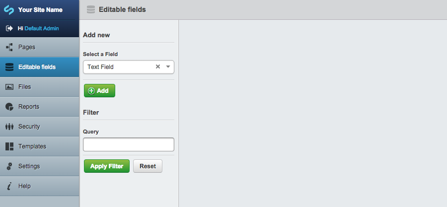
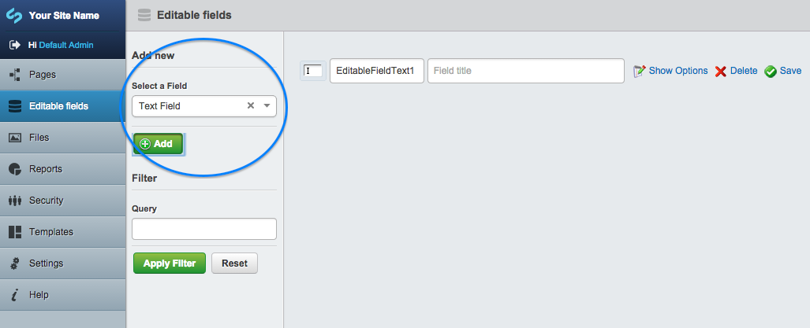
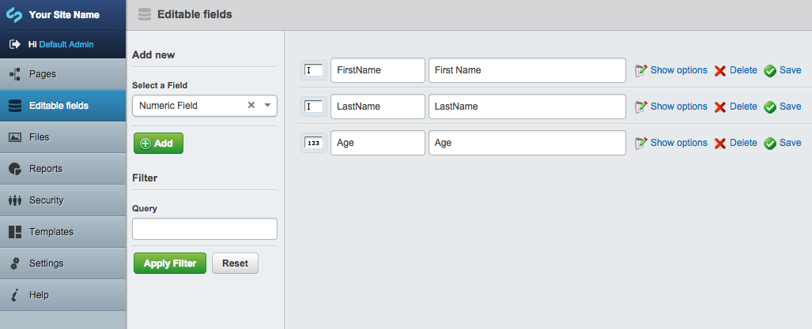
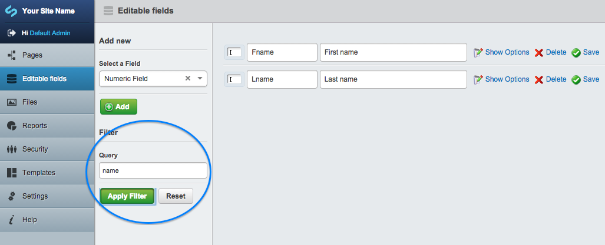

How to use Editable Field (silverstripe-editablefield)
==============

### Overview

On the first column of the CMS administration view there is a menu item labelled **Editable fields**.

- Click on **Editable fields** to open the management interface.

On the second column there are 2 forms. The first form is for adding a new field and the second form is for filtering the list of displayed fields.

### Add new editable field

- Select a field from the drop down menu
- Click the **Add** button. The field will appear in the column to the right.

### View and edit existing editable fields

The far right column, lists the first 50 fields. The list that gets displayed is based on the filter query, and is ordered by Title ascending.

### Filter and search existing editable fields

To filter the list of fields displayed, enter your query. The query string is used to search in the fields **Names** and **Titles** for any partially matched values.

### Field types

#### Page Type List Field 
Creates a drop down field that lists pages of a selected page type. From the **Show Options** link, you can choose which page type the field is going to display the list of pages from. (ie. Select Blog pages, would display a drop down that lists blog titles to select from.)

#### Checkbox Field 

Selecting a checkbox field adds a single checkbox to a form, along with a place to
store a label for that checkbox. This is useful for getting information that has a
"Yes or No" answer, such as "Would you like to be contacted?" or "Have you
understood the Terms and Conditions?"

Marking this field as required will require it to be checked.

#### Checkbox Group

Selecting a checkbox group adds a field for multiple checkboxes to a form, along with a
place to store a label for the group. This is useful for getting information that has
multiple discrete answers, such as "Which continents have you visited?" or "Which
software programs do you use on a daily basis?" You will need to click on the "Show
options" link to add user-selectable options.

Marking this field as required will require at least one option to be checked.

#### Country Dropdown

A list of all countries drawn from the internal list of known countries.

#### Date Field

Selecting a date field adds a field for a date in a form. The time of day is not selectable, however.

If your theme enables it, a date picker popup will be displayed to the user on the frontend.

#### Dropdown Field

Selecting a drop-down field adds a dropdown field to a form. This is useful for getting
information that has only one answer among several discrete choices, for example,
"Which region do you live in?" or "What subject is your question about?" You will
need to click on the "Show options" link to add user-selectable options.

#### Email Field

Selecting an Email field adds a textbox where an email address can be entered. Using the Email
field, instead of a normal text field, to store email addresses, allows you to use that email
address in many automated tasks. For example, it allows the CMS to send reply email
automatically when a form is filled out.

#### Heading

Selecting a Heading allows adds a place where you can put a heading for a form, or for
a section of your form. You can choose which level of heading to use (from 1-6) from
the "Show options" link.

If you do not check the "Hide from reports" checkbox then this field will be displayed
in submission reports.

#### HTML Block

Selecting an HTML block allows you to add any HTML code you wish into your form.
You can edit the HTML blog from the "Show options" link.

If you do not check the "Hide from reports" checkbox then this field will be displayed
in submission reports.

Note: Take care not to allow input from unauthorised sources or users, as custom script
or code could be injected into your form.

#### Member List Field

Selecting a Member List Field adds a dropdown field which includes various groups of website
members (such as administrators or forum members) to the form. You can choose which group
of members from the "Show Options" link.

Note: Take care that you do not expose confidential or personal information about your CMS
or front end users as these names will become publicly visible.

#### Numeric Field

A basic text field that will only accept numeric values (numbers and decimals only).

#### Radio Field

Selecting a Radio field adds a field filed with "Radio button" options to a form.
Radio buttons are similar to checkboxes, except that only one button in a radio
field can be checked at a time. This is useful for getting information that has
only one answer among several discrete choices, for example, "What country do
you live in?" or "What subject is your question about?" It is similar to a
dropdown field, but it is more useful for providing larger labels to responses.
For example, a dropdown field may have one or two-word inputs, while a radio
button may have choices that are paragraphs in length. You will need to click
on the "Show options" link to add user-selectable options.

#### Text Field

Selecting a Text field adds a text field to the form. You can click on "Show options"
to determine the size and the number of rows in a text field.
